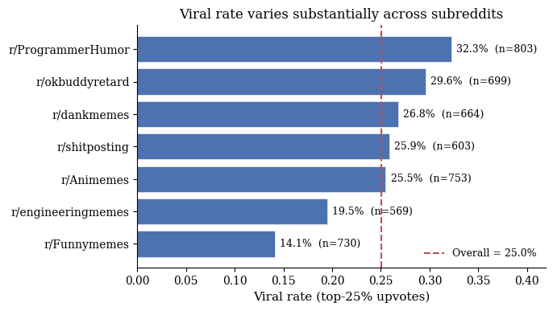
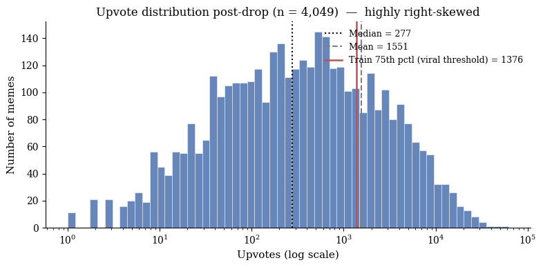
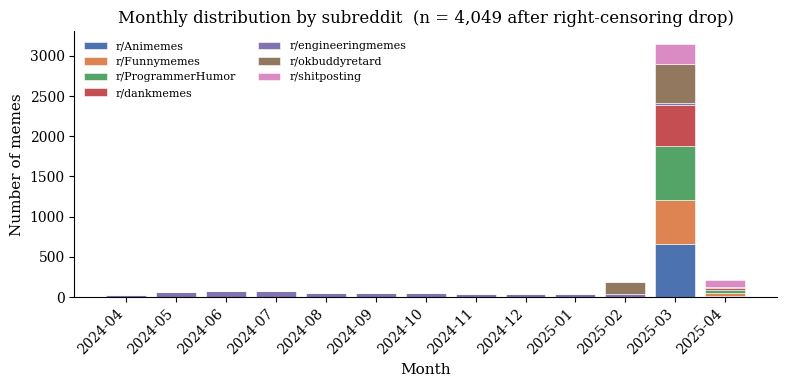
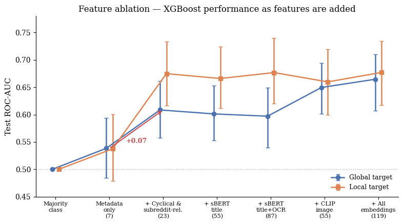
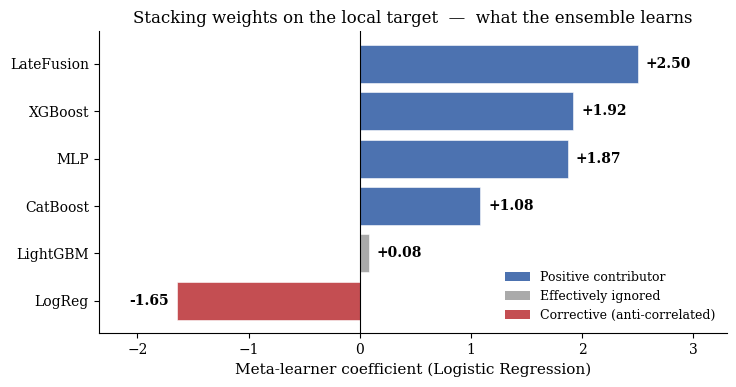
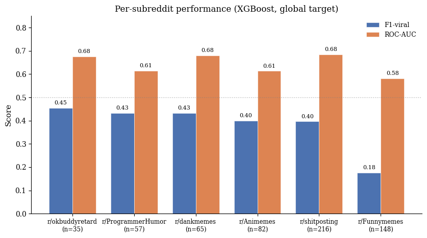

# 🎯 Meme Virality Prediction

> **Will this meme go viral?** A multimodal machine learning pipeline that predicts whether a Reddit meme will land in the **top 25% of upvotes**, using its title, image text (OCR), image content, and posting metadata.

📚 *Final project for Applied Machine Learning.*

🔗 [**Live Demo (Gradio)**](https://huggingface.co/spaces/jl6685/meme-viral-predictor) · 📄 [Final Report](Final_Report.pdf) · 🌐 [Project Website](index.html)

---

## 📋 For Grading — Files to Check

This section maps directly to the assignment requirements so everything is easy to locate.

| Requirement | File / Location |
|---|---|
| 📝 **Blog post** (MIT format, renders in Chrome) | [`index.html`](index.html) — open locally, no external dependencies needed |
| 📦 **Self-contained submission zip** | [`html.zip`](html.zip) — contains `index.html` + all assets |
| 📄 **Full written report** | [`Final_Report.pdf`](Final_Report.pdf) |
| ✍️ **Blog post draft (PDF)** | [`First Draft of Blog Post.pdf`](First%20Draft%20of%20Blog%20Post.pdf) |
| 🧪 **One notebook that reproduces all blog-post figures** | [`Meme_Virality_Report_Concise.ipynb`](Meme_Virality_Report_Concise.ipynb) |
| 🔬 Supporting notebooks (EDA, baseline, full pipeline) | [`EDA_Final.ipynb`](EDA_Final.ipynb), [`Model Baseline.ipynb`](Model%20Baseline.ipynb), [`ModelV1.ipynb`](ModelV1.ipynb) |
| 🎮 **Live interactive demo** | [`.gradio/`](.gradio) (see [Live Demo](#-live-demo) below) |
| 📊 Data splits | [`Data/`](Data) (train / val / test) |
| 💾 Trained model artifacts | [`outputs/`](outputs), [`catboost_info/`](catboost_info) |
| ⚖️ License | [`LICENSE`](LICENSE) (MIT) |

> **To reproduce the figures in the blog post**: open `Meme_Virality_Report_Concise.ipynb` and run all cells top-to-bottom. Outputs (saved figures, model AUCs) match those in `index.html`.

---

## 📌 Project Goal

Given a meme — its **image**, **title**, and **context features** (subreddit, posting time, author info) — predict whether it will become **popular**, defined as reaching the **top 25th percentile of upvotes**.

We frame the task as **binary classification** with two parallel targets:

| Target | Definition |
|---|---|
| `is_viral_global` | Upvotes ≥ 75th percentile across **all** posts in the training set |
| `is_viral_local` | Upvotes ≥ 75th percentile **within the post's own subreddit** |

The local target is the more meaningful one — it controls for the fact that some subreddits get vastly more engagement than others (e.g. r/shitposting averages ~25K upvotes, r/Funnymemes ~600).



---

## 📊 Dataset

We use a **publicly available Reddit memes dataset** containing **~4,800 posts** from 7 meme-focused subreddits, scraped between **April 2024 and April 2025**. We did not collect the data ourselves — see the report for the original source and citation.



| Subreddit | 75th-percentile upvote threshold |
|---|---:|
| r/shitposting | 25,928 |
| r/ProgrammerHumor | 2,432 |
| r/dankmemes | 1,709 |
| r/okbuddyretard | 1,558 |
| r/Animemes | 1,390 |
| r/engineeringmemes | 934 |
| r/Funnymemes | 592 |

### Splits

We use a **temporal split** (no random shuffling) so the model is always evaluated on posts **strictly newer** than what it was trained on — mirroring how it would be used in practice. We also apply a **right-censoring guard** to drop posts that were too recent at scrape time to have stable upvote counts.



| Split | Rows | Date range |
|---|---:|---|
| Train | 3,374 | earliest 70% |
| Validation | 723 | middle 15% |
| Test | 724 | latest 15% |

### Sample meme


### Features available per post

- **Metadata** — subreddit (`Category`), posting hour, day of week, time-of-day bucket, account age in days, author karma
- **Title text** — raw post title
- **OCR text** — text extracted from the meme image itself (`Extracted Text`)
- **Image** — the meme image file (used for CLIP embeddings)
- **Engineered** — title length, OCR length, sentiment scores (BERT title + OCR compound, polarity, subjectivity)

---

## 🛠️ Pipeline Overview

The project is organized as a **three-stage pipeline**, with each stage adding a layer of features or modeling complexity.

```
┌──────────────────┐   ┌──────────────────────────┐   ┌─────────────────────┐
│  Stage 1         │ → │  Stage 2                 │ → │  Stage 3            │
│  Baseline (XGB)  │   │  Feature Engineering     │   │  Model Zoo +        │
│  7 raw features  │   │  + cyclical time         │   │  Stacking Ensemble  │
│                  │   │  + subreddit-relative    │   │                     │
│                  │   │  + sBERT (title + OCR)   │   │                     │
│                  │   │  + CLIP (image)          │   │                     │
└──────────────────┘   └──────────────────────────┘   └─────────────────────┘
       7 feats                  119 feats                7 model families
```

### Stage 1 — Baseline

A vanilla XGBoost classifier on **7 raw metadata features** (`Category`, `Time of Day`, `post_day`, `title_len`, `ocr_len`, `post_hour`, `account_age_days`). Establishes the floor we need to beat.

### Stage 2 — Feature Engineering

Five additive feature blocks, each ablated independently so we can measure marginal lift:

- **M1+ Cyclical time** — `sin/cos` of hour and day-of-week, `is_weekend`, `month_of_year`
- **M2 Subreddit-relative** — z-scores and percentile ranks within each subreddit (e.g. *"is this title unusually long for r/Animemes?"*), distance from the subreddit's peak posting hour, and per-subreddit popularity priors
- **M5 Text embeddings** — sentence-BERT (`all-mpnet-base-v2`, 768-dim) on **title** and **OCR text**, reduced to 32 dims each via PCA
- **M5 Image embeddings** — CLIP image features (512-dim) reduced to 32 dims via PCA
- **Cross-modal scalar** — cosine similarity between title and OCR embeddings

Final feature matrix: **119 dimensions** (23 tabular + 32 sBERT-title + 32 sBERT-OCR + 32 CLIP-image).



### Stage 3 — Model Zoo + Ensemble

We train and compare **seven model families** on the full 119-dim feature matrix:

1. Logistic Regression (L2-regularized)
2. XGBoost
3. LightGBM
4. CatBoost
5. MLP
6. Multimodal Late-Fusion Neural Network (separate towers for tabular / sBERT-title / sBERT-OCR / CLIP, fused at the top)
7. **Stacking ensemble** — a logistic-regression meta-learner trained on the validation-set probabilities of the six base models



---

## 📈 Results

- 🏆 **Best on GLOBAL target** — CatBoost, test AUC **0.6709**
- 🏆 **Best on LOCAL target** — Stacking ensemble, test AUC **0.7758**



### Feature-importance breakdown (full multimodal model)

About **80% of the predictive signal** comes from learned embeddings, not metadata:

| Feature group | Share of importance |
|---|---:|
| CLIP image embeddings (PCA-32) | ~29% |
| sBERT OCR embeddings (PCA-32) | ~26% |
| sBERT title embeddings (PCA-32) | ~26% |
| Subreddit-relative tabular features | ~9% |
| Raw baseline metadata | ~5% |
| Cyclical time | ~4% |
| Title↔OCR cosine similarity | ~1% |

**Takeaway**: what the meme *looks like* and *says* matters far more than when it was posted or who posted it.

For full methodology, ablation studies, McNemar significance tests, and per-subreddit breakdowns, see [`Final_Report.pdf`](Final_Report.pdf).

---

## 🎮 Live Demo

We've built a **Gradio app** that wraps our best stacking model — upload a meme, pick a subreddit and posting time, and get back a virality probability.

> 🔗 **Try it here:** [https://huggingface.co/spaces/jl6685/meme-viral-predictor](https://huggingface.co/spaces/jl6685/meme-viral-predictor)

### Run locally

```bash
cd .gradio
python app.py
```

The app will start a local server (default `http://127.0.0.1:7860`) where you can:

- 📤 Upload a meme image
- ✏️ Enter the title you'd post it with
- 🎯 Pick the target subreddit (one of the 7 we trained on)
- ⏰ Choose a posting hour and day of week
- 🚀 Get back the predicted **virality probability** and a Top-25% / Not-Top-25% verdict

Under the hood, the app runs the same OCR → sBERT → CLIP → tabular feature → stacking ensemble pipeline as the training notebook.

---

## 📁 Repository Structure

```
.
├── .gradio/                            # Gradio app for interactive predictions
├── Data/                               # Train / val / test CSV splits
├── catboost_info/                      # CatBoost training artifacts
├── html/                               # Project website assets
├── outputs/                            # Saved models, embeddings, prediction artifacts
│
├── EDA_Final.ipynb                     # Exploratory data analysis
├── Model Baseline.ipynb                # Stage 1 baseline (XGBoost on metadata only)
├── ModelV1.ipynb                       # Stage 2 + 3: feature engineering and model zoo
├── Meme_Virality_Report_Concise.ipynb  # ⭐ Main notebook — reproduces all blog-post figures
│
├── Final_Report.pdf                    # Full project report
├── First Draft of Blog Post.pdf        # Blog post draft
├── index.html                          # Blog post (renders locally in Chrome)
├── html.zip                            # Self-contained submission zip
│
├── feature_ablation.png                # Stage 2 ablation results
├── rightcensoring.png                  # Right-censoring filter visualization
├── sample_meme.png                     # Example data point
├── stacking.png                        # Stacking ensemble weights
├── subreddit_performance.png           # Per-subreddit F1 / AUC breakdown
├── upvotedistri.png                    # Upvote distribution
├── viral_subreddit.png                 # Viral rate per subreddit
│
├── LICENSE                             # MIT
└── README.md
```

---

## 🚀 Reproducing Our Results

### Requirements

- Python 3.10+
- A GPU (Colab T4 or better) for the sBERT / CLIP / late-fusion stages
- Roughly 4 GB of free disk for cached embeddings

### Install

```bash
pip install numpy pandas scikit-learn matplotlib \
            xgboost lightgbm catboost \
            torch sentence-transformers \
            pillow gradio
```

### Run

The fastest path is to open **`Meme_Virality_Report_Concise.ipynb`** in Google Colab (or Jupyter with GPU) and execute top-to-bottom. The notebook is self-contained and reproduces every figure in the blog post, including:

1. Data loading and temporal split (from `Data/`)
2. Dual-target threshold computation
3. Stage 1 baseline
4. Stage 2 feature engineering with ablations
5. Stage 3 model zoo + stacking ensemble
6. Evaluation, McNemar significance tests, and per-subreddit breakdowns

Embeddings are cached to disk on first run, so re-runs are fast.

---

## 🔮 Future Work

- **Calibration** — current probabilities aren't well-calibrated; isotonic regression or Platt scaling could help
- **More subreddits** — only 7 communities are represented; broader coverage would help the global target
- **Temporal drift** — meme trends change fast; periodic re-training would be needed in production
- **Vision-language end-to-end** — fine-tuning CLIP or a small VLM directly on the virality task instead of using frozen embeddings

---

## 👥 Authors

Applied Machine Learning Final Project — *Jiawei Lou and  Ariela Lope*

## 📄 License

MIT — see [`LICENSE`](LICENSE).
